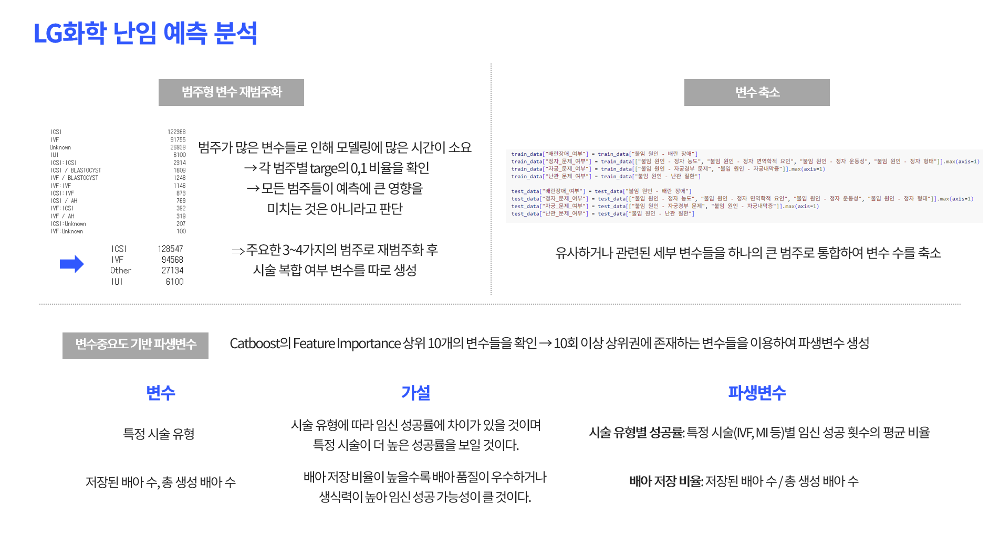

 # 👶 LG화학 난임 예측 분석
📌 **공모전/해커톤 개요**  
이 프로젝트는 **LG aimers 6기 해커톤** 에서 진행한 팀 프로젝트로, **난임 환자 데이터를 활용하여 임신 성공 여부를 예측**하고 임신을 결정짓는 최적의 특성을 탐색하는 AI 모델을 개발하고자 하였습니다.     

📌 **발표 자료 및 코드**  
🔗 [코드 저장소](https://github.com/HyeyoonKim0711/LG_aimers_6th/blob/main/online_final_code.ipynb)

---

## 🎯 **공모전/해커톤 정보**
- **대회명**: LG aimers 해커톤 6기
- **주최 기관**: LG화학
- **진행 기간**: 2025.02.01 - 2025.02.27 (온라인 해커톤)
- 🏫 **온라인 해커톤 87위 / 794팀**  

---
## 👥 참여 인원
5명

---
## ✅ 역할
- 데이터 전처리 및 Feature Engineering  
- 하이퍼파라미터 튜닝 및 모델 성능 개선

---

## 📊 **프로젝트 개요**
- **사용된 데이터셋**: 난임 환자들의 시술 정보, 불임 원인, 배아 생성 등 난임 치료와 관련된 다양한 데이터
- **데이터 설명**: 난임 시술 종류, 시기와 같은 시술 관련 변수와 특정 질환 또는 불임 요인과 관련된 개인의 건강 관련 변수 
- **주요 과제**: 최종적으로 해당 난임 환자가 임신에 성공했는지의 여부를 예측하는 **Binary Classification** 문제
- **핵심 목표**:
  - 임신 성공 여부를 사전에 예측하는 정확도 높은 AI 모델 개발
  - 실제 데이터 분석을 통해 임신을 결정짓는 최적의 특성을 탐색하고 난임 치료의 효율성을 높일 수 있는 방향을 모색

---

## 💻 **모델 및 기술 스택**
- **사용한 기법**: **Catboost** 사용
    → **Optuna**를 활용한 하이퍼파라미터 튜닝
  - 그 외 시도했던 기법들 : Xgboost, LightGBM
- **사용한 기술 및 라이브러리**:
  - 프로그래밍 언어: Python
  - 데이터 분석: pandas, numpy
  - 머신러닝: scikit-learn, XGBoost, LightGBM
- **모델 평가 지표**: **ROC-AUC**

---

## 🛠️ **분석 과정**
### 1️⃣ **데이터 전처리 및 EDA**
- target 변수에 대한 연속형 변수의 평균 비율 / 범주형 변수의 범주별 비율 확인
- 범주형 변수의 범주를 줄이기 위해 일부 변수들은 재범주화 또는 원핫인코딩을 진행
- 결측이 매우 많은 데이터 → 결측 자체를 하나의 범주(unknown)로 처리
- 범주형으로 정의된 변수들 중 연속형일 때 더 유의미한 변수들은 연속형으로 전처리 수행

### 2️⃣ **파생변수 생성**
- Feature Importance 상위에 위치한 변수들에 대해 파생변수 생성

### 3️⃣ **모델 학습**
- **Train/Validation Split**: target 분포 고려한 7:3 Stratified Split
- **CatBoost 단일 모델**을 사용
  - catboost의 **cat_features** 파라미터를 이용해 변수들을 범주형으로 처리
- 다양한 seed에서 성능이 안정적인 모델만 선택
- **Optuna**를 활용한 과적합 방지 파라미터 튜닝
  - 사용한 주요 파라미터: `l2_leaf_reg`, `bagging_temperature`
- 최종적으로 **ROC-AUC가 가장 높은 파라미터 조합**을 선정
  

---

## 📈 **최종 모델 성능 (ROC-AUC)**
| 모델 | Public | Private | 
|------|------------|------------|
| Catboost | 0.7416 | 0.7419 | 

---

## 🚀 **적용 가능성**
- **치료 성공률 향상**: 시술 전 예측 모델을 활용하여 성공 확률이 높은 환자를 선별하고, 맞춤형 치료 전략을 수립
- **의료 현장 적용**: 병원의 의료기록 시스템 및 난임 치료 시스템과 연동하여 실시간으로 예측 결과 제공
- **연구 활용**: 난임과 관련된 중요한 변수 및 성공 요인에 대한 인사이트 제공

---

## ✍️ 분석 의의
- 의료 도메인 데이터를 활용하여 실제 난임 환자들의 임신 성공 여부를 예측하는 모델 개발 경험
- 다수의 범주형 변수 및 결측 처리 문제를 해결하며 실무적 데이터 핸들링 역량 강화

